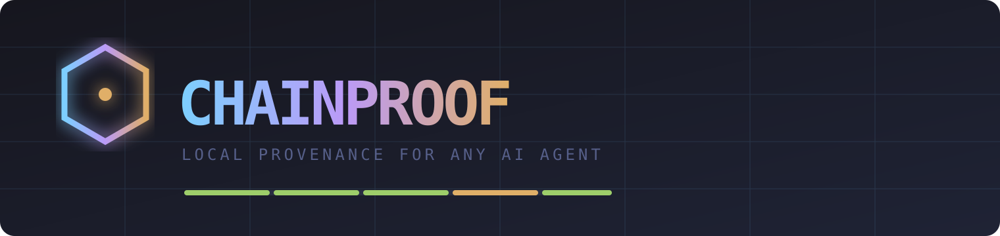
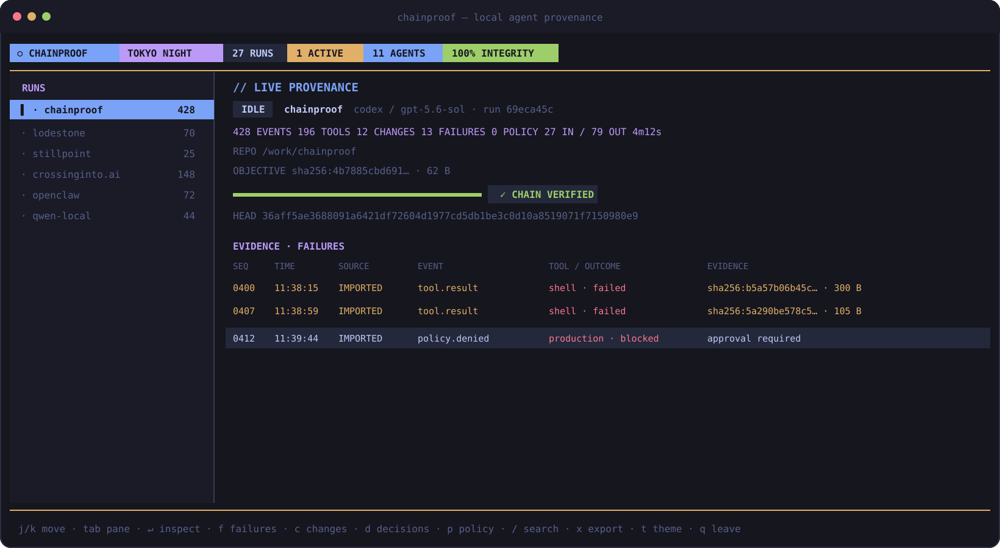

<p align="center">
  
</p>

<p align="center">
  <strong>See what the agent did. Know where the record came from. Verify it did not change.</strong>
</p>

<p align="center">
  <a href="https://chainproof.ai">Website</a> ·
  <a href="#install">Install</a> ·
  <a href="#the-run-cockpit">Run cockpit</a> ·
  <a href="#bring-any-agent">Integrations</a> ·
  <a href="spec/provenance-v1.md">Proof format</a>
</p>

ChainProof is a local-first provenance ledger and investigation cockpit for AI
agents — one Go binary, one SQLite database, and a hash chain you can verify
without trusting ChainProof.

Run Codex, Claude Code, Kimi, Qwen, OpenClaw, a local model, or your own
harness. ChainProof turns agent activity into a durable operational record:
inputs, tools, commands, changes, outputs, failures, policy signals, artifacts,
collection source, and cryptographic continuity.

<p align="center">
  
</p>

It is built to answer four questions after an agent has been at work:

- **What happened?** Read the run as a sequence of inputs, tool calls, outputs,
  decisions, artifacts, errors, and human events.
- **Where did this record come from?** Every event says whether it was
  `observed`, `reported`, `imported`, or `derived`.
- **Has it changed?** Recompute the chain from genesis, or hand the exported
  proof to someone who has never installed or trusted your database.
- **Is it ready to ship?** Jump to failures, changes, decisions, and policy
  evidence without digging through a raw agent transcript.

No account. No API key. No tenant. No pricing page. The ledger lives on your
machine and the code is MIT licensed.

Ordinary logs tell you what a process printed. ChainProof preserves the
provenance around it: who or what produced an event, which adapter collected
it, whether collection was live or retrospective, where it sits in the run,
and the exact hash link that would change if history were rewritten. The
search index and cockpit are disposable views; the canonical ledger remains
the evidence.

## Install

ChainProof is one Go binary. Install the latest release on macOS or Linux:

```sh
curl -fsSL https://raw.githubusercontent.com/vajramatt/chainproof/main/scripts/install.sh | sh
```

Or, with Go 1.24 or newer:

```sh
go install github.com/vajramatt/chainproof/cmd/chainproof@v0.5.0
```

Or build the checkout:

```sh
git clone https://github.com/vajramatt/chainproof.git
cd chainproof
make build
./chainproof
```

The installer verifies the release archive against its published SHA-256
checksum. The database opens at `~/.chainproof/chainproof.db`; set
`CHAINPROOF_DB` to put it somewhere else.

## Open it

```sh
chainproof
```

That is enough. ChainProof discovers the Codex sessions under
`~/.codex/sessions`, imports what is already there, follows active session
files once a second, and opens the TUI. New turns appear without launching
Codex through ChainProof.

The local web app does the same:

```sh
chainproof serve           # collector + API + dashboard at 127.0.0.1:7331
```

The collector remembers a byte cursor per session file, so restarting catches
up and does not duplicate events. One Codex session becomes one ChainProof run.

By default, message bodies, commands, output, and changed-file details are
stored as a hash and byte count. The operational shape remains visible without
silently copying the transcript. Because the database is local, you can opt in
to full content:

```sh
CHAINPROOF_CODEX_CONTENT=full chainproof
```

Use a nonstandard Codex home—or turn discovery off—with:

```sh
CHAINPROOF_CODEX_ROOT=/path/to/codex/sessions chainproof
CHAINPROOF_CODEX_DISABLED=1 chainproof
```

## Keep it running

Install ChainProof as a per-user background service:

```sh
chainproof service install
```

On macOS this creates a private user LaunchAgent; on Linux it creates and
enables a systemd user service. It starts at login, follows Codex while the TUI
is closed, owns the localhost API, and keeps the ledger current.

```sh
chainproof service status
chainproof service stop
chainproof service start
chainproof service uninstall   # the SQLite ledger is preserved
```

With the service running, `chainproof` detects it and opens the TUI without
starting a second collector. The web dashboard remains at
`http://127.0.0.1:7331`, and machine-readable health lives at
`http://127.0.0.1:7331/api/status`.

For supervisors, containers, or debugging, run the same process in the
foreground:

```sh
chainproof daemon
```

## Wrap another agent

The quickest path is to let ChainProof wrap a harness:

```sh
chainproof run -- codex
chainproof run -- claude
chainproof run -- opencode
chainproof run -- your-agent --task task.json
```

Then open the ledger:

```sh
chainproof                 # the TUI is the front door
chainproof serve           # local web dashboard at 127.0.0.1:7331
```

Wrapping records the process lifecycle and exit status as **observed**. It does
not magically reveal internal tool calls or private model reasoning. A native
hook, push integration, or pull adapter provides the richer event stream.

## The run cockpit

The TUI is a deterministic run cockpit: repository and objective fingerprint,
duration, tool/change/failure/policy signals, chain integrity, a full-width
evidence table, operational filters, canonical event inspection, and proof
export. Every summary fact resolves to ledger evidence.

```text
  ⬡ CHAINPROOF  TOKYO NIGHT  27 RUNS  1 ACTIVE  11 AGENTS  100% INTEGRITY
  RUNS                    // LIVE PROVENANCE
  ▌ chainproof  428       428 EVENTS · 196 TOOLS · 13 FAILURES · 4m12s
    lodestone    70       REPO      /work/chainproof
    stillpoint   25       OBJECTIVE sha256:4b7885c… · 62 B
                          EVIDENCE · FAILURES
                          0400 11:38:15 IMPORTED tool.result shell · failed
```

### Keys

| key | what |
| --- | --- |
| `j` / `k` · arrows | move through runs |
| `Tab` | switch focus between runs and evidence |
| `Enter` | inspect the selected canonical event |
| `f` / `c` / `d` / `p` / `a` | failures / changes / decisions / policy / all |
| `/` | search evidence; supports `tool:`, `status:`, `agent:`, `kind:`, `mode:`, `file:` |
| `x` | export the selected portable proof to `~/.chainproof/exports` |
| `v` / `r` | reload and verify the selected run |
| `t` | change the light: Tokyo Night ↔ Synthwave '84 |
| `q` / `ctrl-c` | leave |

Tokyo Night is the house light. Synthwave '84 repaints the room in violet,
electric pink, and cyan. The local web dashboard carries both palettes too;
its switch is remembered in the browser. ChainProof explicitly enables
truecolor for the interactive TUI because terminal launchers often leak
`TERM=dumb` or `NO_COLOR`; use `CHAINPROOF_COLOR=never` for intentional
monochrome output.

## Investigate what happened

The append-only ledger is the source of truth. Alongside it, ChainProof keeps
a rebuildable SQLite provenance index so the evidence is useful while an
incident—or an agent—is still moving.

Press `/` in the TUI, open **Investigate** in the web dashboard, or query from
the shell:

```sh
chainproof search "failed"
chainproof search "internal/store/search.go"
chainproof search "e4be0f5dbd629073"
```

The web interface combines free-text search with facets for agent, event kind,
tool, status, and collection mode. Selecting a result reveals its canonical
payload, native source identity, previous hash, and event hash. You can search
tool names, paths, working directories, outcomes, and hashes even when message
content is protected by the default hashes-only policy.

The index is deliberately not part of the proof. It can be deleted and rebuilt
from canonical ledger events without changing a chain head. See
[`docs/investigation.md`](docs/investigation.md) for the boundary and query API.

The next-generation local browser experience is specified in
[`docs/web-explorer.md`](docs/web-explorer.md): a run cockpit for timelines,
diffs, artifacts, failure analysis, comparison, and proof reports—not a hosted
SaaS dashboard.

## Bring any agent

The proof format knows nothing about model vendors. Integrations sit at the
edge and normalize into one stable event shape. There are four ways in:
automatic discovery, push, pull, and process wrapping.

### Codex — discovered automatically

The built-in `codex-local-v1` adapter reads Codex's local JSONL session files.
It normalizes:

- session metadata and working directory
- model, approval policy, and turn context
- turn start and completion
- user and agent messages
- shell execution, status, exit code, stdout, and stderr
- file changes, extension calls, and image views

Reasoning records are deliberately skipped. Imported Codex records are marked
**imported**: ChainProof is protecting Codex's local account of the session,
not claiming to have independently observed the model.

Run a one-shot catch-up or watch without opening either interface:

```sh
chainproof codex sync
chainproof codex watch
```

### Push — the harness tells ChainProof

Create a run and append events over the localhost API or CLI:

```sh
chainproof start --agent qwen-local --harness my-runner --model qwen3

chainproof append RUN_ID '{
  "kind": "tool.call",
  "source": { "adapter": "my-runner", "mode": "reported" },
  "payload": { "tool": "shell", "command": "git status" }
}'

chainproof complete RUN_ID
```

The same operations are available at `POST /api/runs` and
`POST /api/runs/{id}/events` when `chainproof serve` is running.

### Pull — ChainProof reads a local history

Normalize a harness transcript to one JSON object per line:

```sh
chainproof pull RUN_ID ~/.local/share/my-agent/events.jsonl my-agent
```

ChainProof remembers a byte cursor for the adapter and source path. Run it
again and only appended records come across. Pulled history is always marked
**imported**, even if the source file claims otherwise.

### Wrap — ChainProof watches the process

```sh
chainproof run -- codex
```

The wrapper observes process start, exit, and final status. Claude Code and
other harnesses still need wrapping or a generic push/pull integration today;
Codex has native automatic discovery.

The adapter contract and integration guidance live in
[`docs/integrations.md`](docs/integrations.md).

## OpenClaw

The OpenClaw integration ships in
[`integrations/openclaw`](integrations/openclaw). Start the local server, build
the hook, and install that directory in OpenClaw:

```sh
chainproof serve
cd integrations/openclaw
npm ci && npm run build
```

It records session lifecycle, human messages, tool results, and model outputs.
Message and tool bodies are hashed by default. Set
`CHAINPROOF_STORE_CONTENT=true` to store their content as local,
content-addressed artifacts.

No ChainProof API key is involved. The hook talks to
`http://127.0.0.1:7331` unless `CHAINPROOF_URL` says otherwise.

## What a proof proves

Each event includes the hash of the event before it:

```text
genesis = 0000000000000000000000000000000000000000000000000000000000000000

event[0] = sha256(canonical event[0] + genesis)
event[1] = sha256(canonical event[1] + event[0])
event[2] = sha256(canonical event[2] + event[1])
...
chain head = final event hash
```

Verification pins the genesis hash and checks contiguous sequence numbers, run
identity, every previous-hash link, every event hash, the declared entry count,
and the declared chain head. That catches edits, reordering, missing middle
records, and prefix truncation.

Export a portable bundle and verify it without opening a database:

```sh
chainproof export RUN_ID proof.json
chainproof verify-file proof.json
```

The verifier works on a clean machine because the proof bundle contains the
run declaration and canonical events. The format is documented in
[`spec/provenance-v1.md`](spec/provenance-v1.md).

> ChainProof records what an agent, harness, adapter, or observer reports. A
> valid chain proves continuity of those recorded bytes. It does **not** prove
> that the report was truthful, complete, or produced by the model it names.

## Collection marks

| mark | meaning |
| --- | --- |
| `observed` | ChainProof captured the event directly while execution occurred |
| `reported` | an agent or harness submitted the event |
| `imported` | an adapter collected an existing record after the fact |
| `derived` | ChainProof calculated the event from other recorded material |

These are provenance labels, not trust scores. A perfectly valid imported chain
is still an imported chain.

## Local, by design

ChainProof stores runs, canonical events, adapter cursors, and artifacts in a
local SQLite database using WAL mode and serialized writes. Artifact hashes are
computed over raw bytes—not decoded text—and content-addressed by SHA-256.

The web server binds to `127.0.0.1:7331` by default and rejects non-local host
headers. v0.5.0 intentionally has no multi-user authentication; do not expose it
to a network.

The things ChainProof writes are its own:

- `~/.chainproof/chainproof.db` — ledger, rebuildable search index, cursors, and artifacts
- `~/.chainproof/chainproof.db-wal` — SQLite's write-ahead log while active
- `~/.chainproof/exports/` when you press `x` in the TUI
- another export path only when you ask for one with `chainproof export`

It does not edit the repositories or harness histories it observes.

## Commands

| command | what |
| --- | --- |
| `chainproof` / `chainproof ui` | open the terminal interface |
| `chainproof serve [address]` | run the local API and web dashboard |
| `chainproof daemon` | run the collector and local API in the foreground |
| `chainproof service install` | install and start a login service |
| `chainproof service status` | inspect the native user service |
| `chainproof start` | open a provenance run |
| `chainproof append` | append one reported event |
| `chainproof ingest` | import JSONL from stdin |
| `chainproof pull` | incrementally import a JSONL file |
| `chainproof run -- …` | wrap any harness or process |
| `chainproof complete` | close a run with a terminal status |
| `chainproof verify` | verify a run in the local ledger |
| `chainproof export` | write a portable proof bundle |
| `chainproof verify-file` | independently verify a bundle |
| `chainproof list` | print local runs as JSON |
| `chainproof search QUERY` | search structured local provenance evidence |
| `chainproof codex sync` | discover and import Codex sessions once |
| `chainproof codex watch` | continuously follow Codex sessions |

Run `chainproof --help` for the one-screen version.

## Build the kitchen

```sh
make check
cd integrations/openclaw && npm ci && npm run typecheck
```

The Go suite includes canonicalization, lifecycle, byte-correct artifact,
tamper, truncation, and wrong-genesis tests. Provider-specific parsing belongs
behind the adapter contract; changes to canonicalization require a versioned
format transition and interoperability fixtures.

Contributions are welcome. Start with [`CONTRIBUTING.md`](CONTRIBUTING.md), and
please report security problems as described in [`SECURITY.md`](SECURITY.md).

## License

[MIT](LICENSE) — use it, fork it, build on it; keep the copyright notice.

© Matt Williamson
